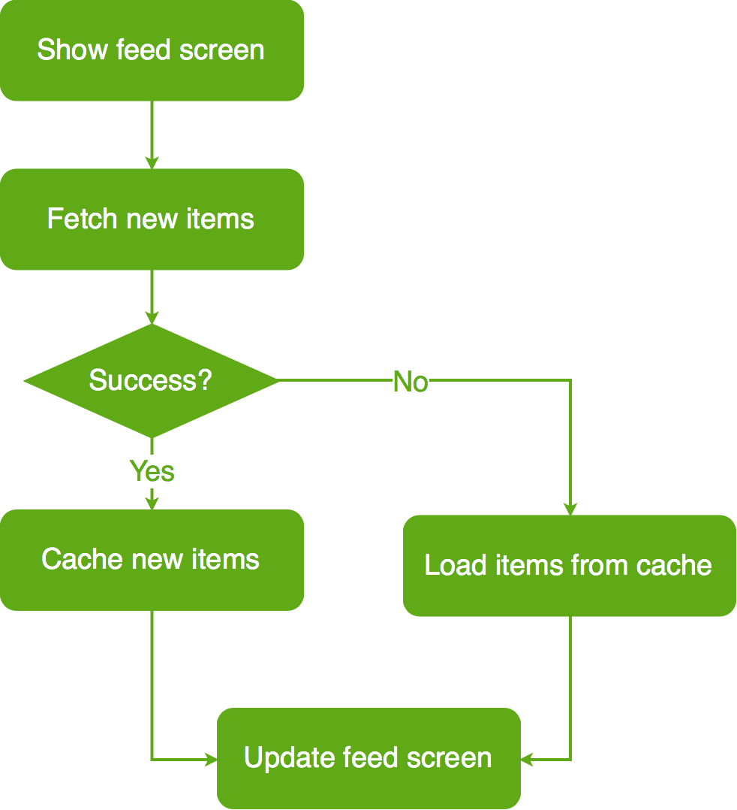
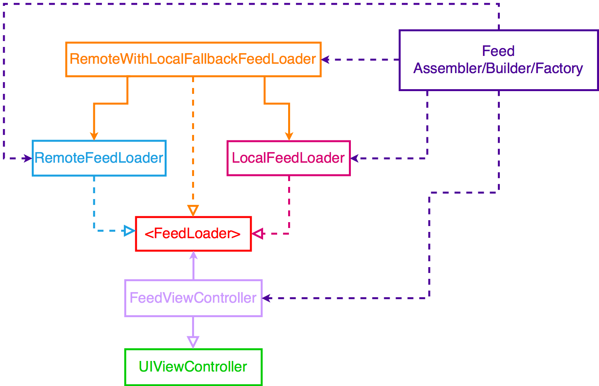

# rickandmorty
Create from https://github.com/essentialdevelopercom/essential-feed-case-study

# Essential Feed App – Image Feed Feature

## BDD Specs

### Story: Customer requests to see their image feed

### Narrative #1
```
As an online customer
I want the app to automatically load randoms characters
So I can always enjoy random characters of the show
```

#### Scenarios (Acceptance criteria)

```
Given the customer has connectivity
When the customer requests to see their feed
Then the app should display random characters feed from remote
  And replace the cache with the new feed
```

### Narrative #2
```
As an offline customer
I want the app to show the latest saved version of my characters feed
So I can always enjoy characters of the show
```

#### Scenarios (Acceptance criteria)

```
Given the customer doesn't have connectivity
And there’s a cached version of the feed
When the customer requests to see the feed
Then the app should display the latest feed saved
Given the customer doesn't have connectivity
And the cache is empty
When the customer requests to see the feed
Then the app should display an error message
```

## Use Cases

### Load Feed Use Case

#### Data:
- URL

#### Primary course (happy path):
1. Execute "Load Feed Items" command with above data.
2. System downloads data from the URL.
3. System validates downloaded data.
4. System creates feed items from valid data.
5. System delivers feed items.

#### Invalid data – error course (sad path):
1. System delivers error.

#### No connectivity – error course (sad path):
1. System delivers error.

### Load Feed Fallback (Cache) Use Case

#### Data:
- Max age

#### Primary course:
1. Execute "Retrieve Feed Items" command with above data.
2. System fetches feed data from cache.
3. System validates cache age.
4. System creates feed items from cached data.
5. System delivers feed items.

#### Expired cache course (sad path): 
1. System delivers no feed items.

#### Empty cache course (sad path): 
1. System delivers no feed items.


### Save Feed Items Use Case

#### Data:
- Feed items

#### Primary course (happy path):
1. Execute "Save Feed Items" command with above data.
2. System encodes feed items.
3. System timestamps the new cache.
4. System replaces the cache with new data.
5. System delivers success message.

## Flowchart



## Architecture



## Model Specs

### Feed Item

| Property      	| Type              |
|---------------	|-------------------|
| `id`          	| `Int`             |
| `name`			| `String`			|
| `status` 	  	| `String` 			|
| `species` 	  	| `String` 			|
| `origin`    	| `String`          |
| `imageURL`    		| `URL`             |

### Payload contract

```
GET *url* (TBD)
200 RESPONSE
{
  "results": [
    {
      "id": 1,
      "name": "Rick Sanchez",
      "status": "Alive",
      "species": "Human",
      "type": "",
      "gender": "Male",
      "origin": {
        "name": "Earth",
        "url": "https://rickandmortyapi.com/api/location/1"
      },
      "location": {
        "name": "Earth",
        "url": "https://rickandmortyapi.com/api/location/20"
      },
      "image": "https://rickandmortyapi.com/api/character/avatar/1.jpeg",
      "episode": [
        "https://rickandmortyapi.com/api/episode/1",
        "https://rickandmortyapi.com/api/episode/2",
        // ...
      ],
      "url": "https://rickandmortyapi.com/api/character/1",
      "created": "2017-11-04T18:48:46.250Z"
    },
    // ...
  ]
}
```
